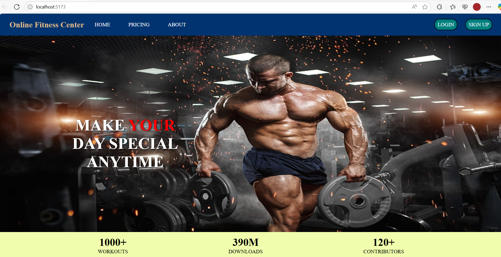
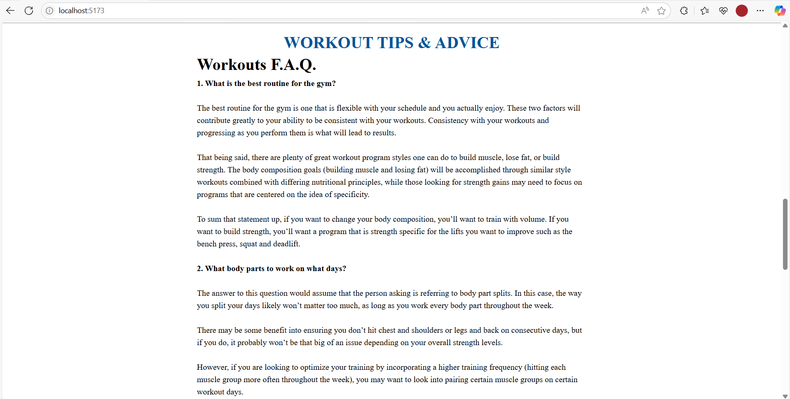
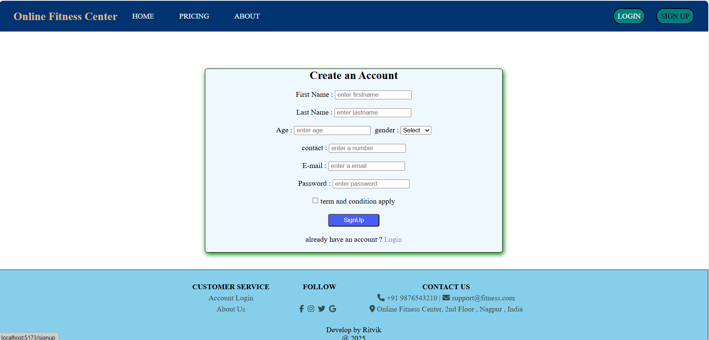
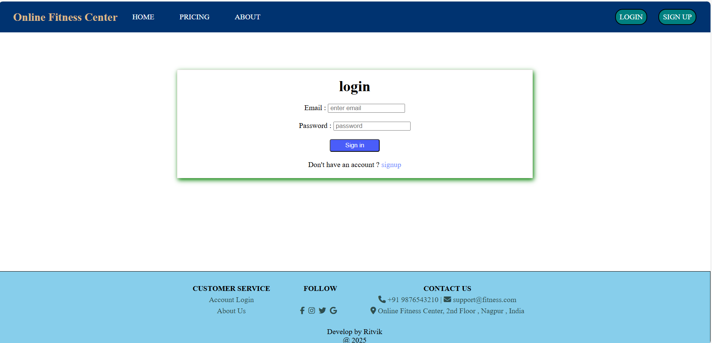
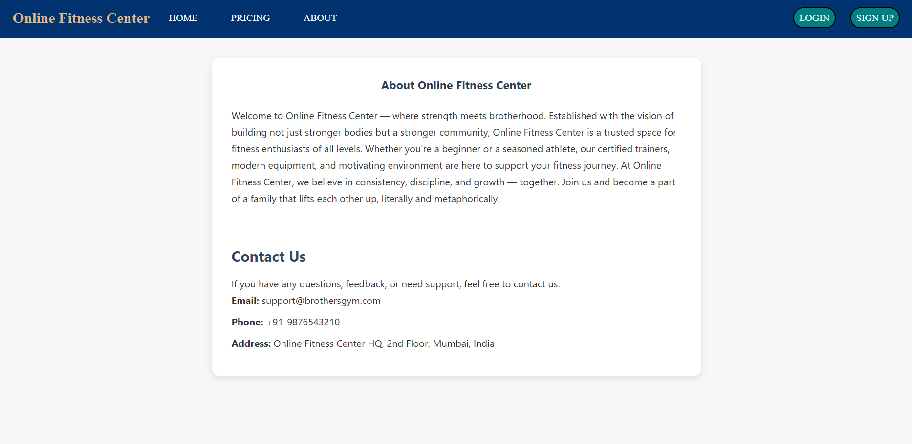
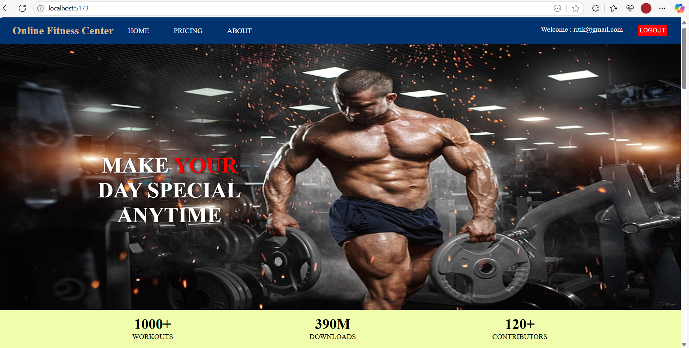
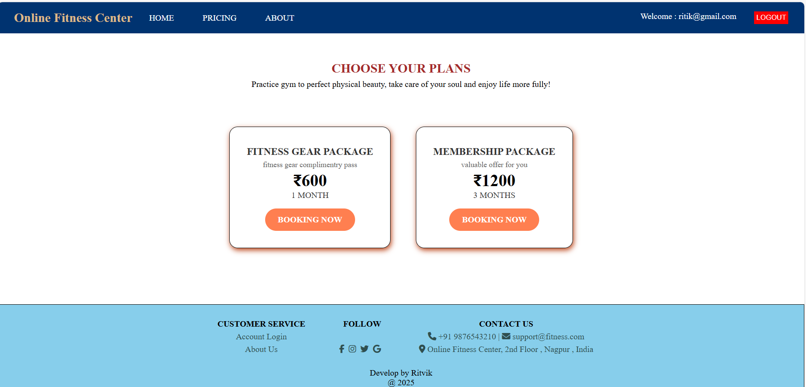
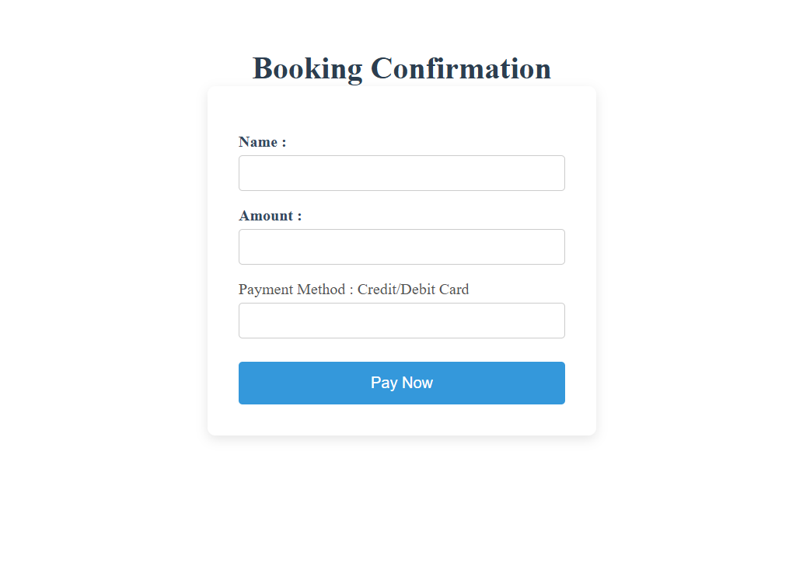
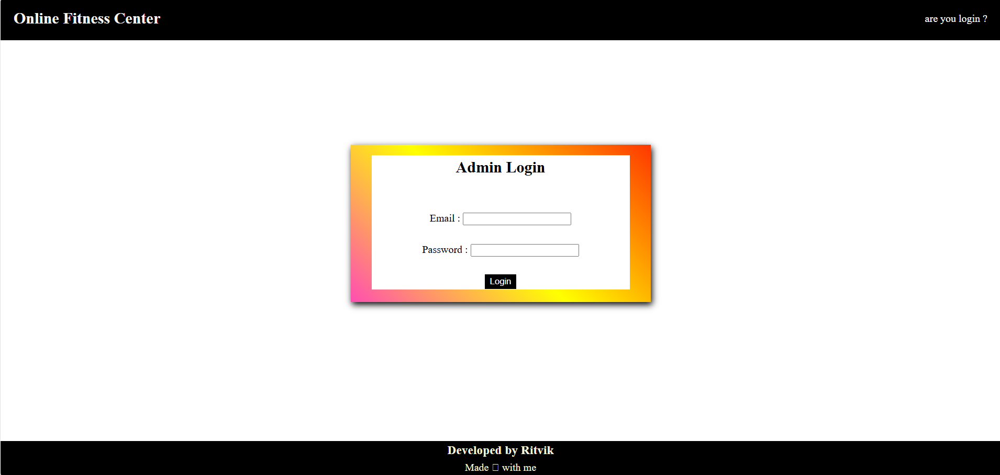
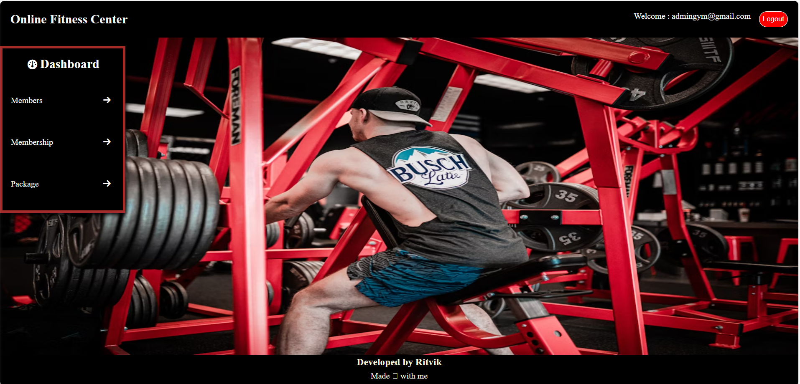

# 🏋️‍♂️ Online Fitness Center

An Online Fitness Center web application built with the **MERN Stack** (MongoDB, Express.js, React, Node.js) that helps users register, explore workout plans, and track fitness progress. This project is designed to simulate the features of a real fitness platform.
---

# 🖼️ Project Screenshots

🏠Home Page 

📝 SignUp Page

🔐 Login Page

ℹ️  About Page

🎟️ After Login Page

🧘 Subscription Plans

💰 Payment Page 

🙍‍♂️ Admin Login Page

🖥️ Admin Dashboard

## 🚀 Features

- 📝 User Registration and Login
- 🧘 View Workout Plans and Packages
- 🛒 Purchase Subscriptions
- 🔐 Protected Routes 
- 📁 Clean Folder Structure: Separate `frontend` and `backend`

---

## 🛠️ Tech Stack

| Layer      | Technology                 |
|------------|----------------------------|
| Frontend   | React, React Router, Axios |
| Backend    | Node.js, Express.js        |
| Database   | MongoDB + Mongoose         |

---

## Start Backend Server

- cd backend
- npm install
- npm start

## Start Frontend Server

- cd frontend
- npm install
- npm start

